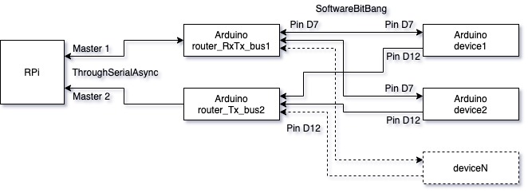
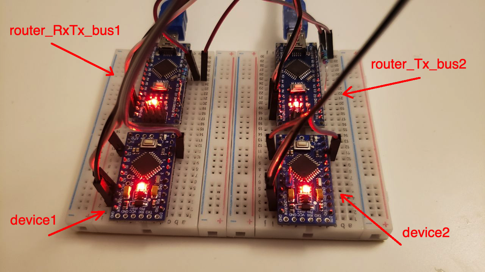
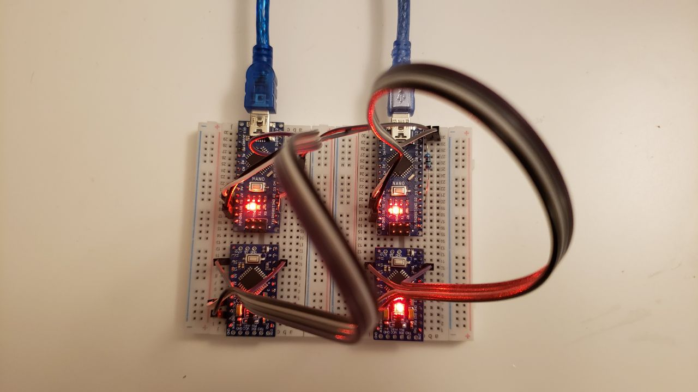

# Two routers

This is the best setup for good stability and performance when need transmit-receive messages from RPi to remote devices AND periodically receive messages from devices to RPi (for example from temperature sensors). Required two separate physical busses, one for transmit-receive messages, another one for only receiving messages.

 

[router_RxTx_bus1](router_RxTx_bus1) - sketch for Arduino router which allow RPi communicate with devices (transmit-receive) connected to one PJON bus

[router_Tx_bus2](router_Tx_bus2) - sketch for Arduino router which allow RPi receive messages from devices connected to another one physical bus

[device1](device1) and [device2](device2) - sketches for Arduino devices which connected to Arduino routers via [SoftwareBitBang](https://github.com/gioblu/PJON/tree/master/src/strategies/SoftwareBitBang) strategy

**Note:** for each router should be runned separate [PJON gRPC Server](../../../server)
